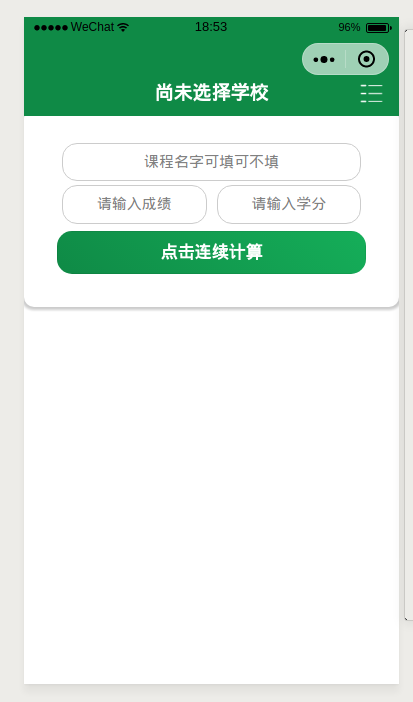
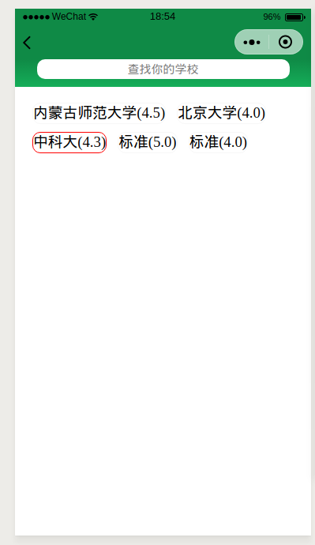
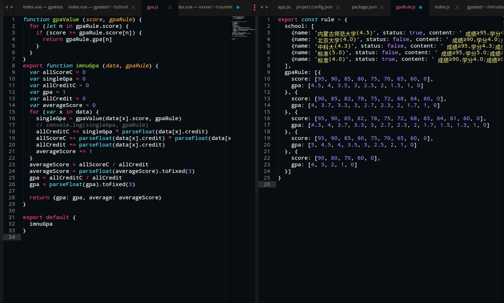

# 绩点计算微信小程序 (mpvue)


[](https://github.com/strugglerx/gpaCalculator/blob/master/LICENSE)

A Mpvue project

## 页面展示
*首页*



*查找*



## GPA算法



### 小程序体验

 

*微信扫码即可，当然我的另外一个小程序：已实现自动获取成绩并计算绩点*

## 使用方式
``` bash
# install dependencies
npm install

# serve with hot reload at localhost:8080
npm run dev

# build for production with minification
npm run build

# build for production and view the bundle analyzer report
npm run build --report
```

### 联系方式：


*我的公众号：[wx-struggler](https://mp.weixin.qq.com/s/KOydGJa7D3dJzl9fvOUTQg)*

*个人微信：（strongdreams）期待我们有共同语言！*

---
### 开源协议

[MIT Copyright (c) 2018 STRUGGLER](https://github.com/strugglerx/gpaCalculator/blob/master/LICENSE)
